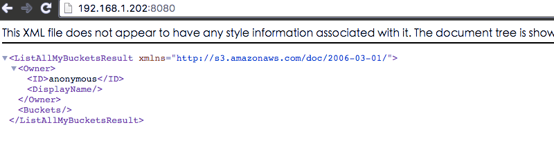

# CEPH

## 介绍


Ceph是一种为优秀的性能、可靠性和可扩展性而设计的统一的、分布式文件系统。

按照以下步骤完成 DCE 环境下的 ceph 部署

### 部署前准备

1. DCE 集群有三台以上 Linux 系统主机

2. 每台主机至少需要增加一块硬盘作为 ceph 的 OSD 存储盘

3. 在每台主机上安装 NFS 软件

### 安装部署
1. 配置 NFS

  创建一个统一挂载点来存储 ceph 配置和相关文件

  * 在每台主机上的相同目录（***/var/ceph***）挂载一个 NFS 文件夹

  * 在文件夹里分别创建[conf,lib,run]三个目录

2. 统一添加的硬盘设备名为***/dev/sdb***

3. 确定主机网络信息，例如:***10.248.4.0/23***

3. 在 DCE 里通过 Compose YML 创建应用，填入一下信息

  ```yaml
  networks: {}
  services:
    mds:
      command: mds
      container_name: mds
      depends_on:
      - mon
      environment:
        CEPHFS_CREATE: '1'
      image: daocloud.io/daocloud/ceph:dev-3
      network_mode: host
      volumes:
      - /var/ceph/conf:/etc/ceph:rw
      - /var/ceph/lib:/var/lib/ceph:rw
    mon:
      command: mon
      container_name: mon
      environment:
        CEPH_PUBLIC_NETWORK: 10.248.4.0/23
        MON_IP: 10.248.4.19
        constraint:node: =ceph-admin
      image: daocloud.io/daocloud/ceph:dev-3
      network_mode: host
      volumes:
      - /var/ceph/conf:/etc/ceph:rw
      - /var/ceph/lib:/var/lib/ceph:rw
    osd0:
      command: osd
      container_name: osd0
      depends_on:
      - mon
      environment:
        OSD_DEVICE: /dev/sdb
        OSD_TYPE: disk
        constraint:node: =ceph-node-1
      image: daocloud.io/daocloud/ceph:dev-3
      network_mode: host
      pid: host
      privileged: true
      volumes:
      - /var/ceph/conf:/etc/ceph:rw
      - /var/ceph/lib:/var/lib/ceph:rw
      - /dev:/dev:rw
    osd1:
      command: osd
      container_name: osd1
      depends_on:
      - osd0
      environment:
        OSD_DEVICE: /dev/sdb
        OSD_TYPE: disk
        constraint:node: =ceph-node-2
      image: daocloud.io/daocloud/ceph:dev-3
      network_mode: host
      pid: host
      privileged: true
      volumes:
      - /var/ceph/conf:/etc/ceph:rw
      - /var/ceph/lib:/var/lib/ceph:rw
      - /dev:/dev:rw
    osd2:
      command: osd
      container_name: osd2
      depends_on:
      - osd1
      environment:
        OSD_DEVICE: /dev/sdb
        OSD_TYPE: disk
        constraint:node: =ceph-node-3
      image: daocloud.io/daocloud/ceph:dev-3
      network_mode: host
      pid: host
      privileged: true
      volumes:
      - /var/ceph/conf:/etc/ceph:rw
      - /var/ceph/lib:/var/lib/ceph:rw
      - /dev:/dev:rw
    rgw:
      command: rgw
      container_name: rgw
      depends_on:
      - mon
      - osd0
      - osd1
      - osd2
      - mds
      environment:
        constraint:node: =ceph-admin
        RGW_CIVETWEB_PORT: '8080'
      image: daocloud.io/daocloud/ceph:dev-3
      network_mode: host
      volumes:
      - /var/ceph/conf:/etc/ceph:rw
      - /var/ceph/lib:/var/lib/ceph:rw
      - /var/ceph/run:/var/run/ceph:rw
  version: '2.0'
  ```
  相关概念：
>
> **mon**
>
> >Monitors: Ceph Monitor维护着展示集群状态的各种图表，包括监视器图、 OSD 图、归置组（ PG ）图、和 CRUSH 图。 Ceph 保存着发生在Monitors 、 OSD 和 PG上的每一次状态变更的历史信息（称为 epoch ）。
>
> **osd**
>
> >Ceph OSDs: Ceph OSD 守护进程（ Ceph OSD ）的功能是存储数据，处理数据的复制、恢复、回填、再均衡，并通过检查其他OSD 守护进程的心跳来向 Ceph Monitors 提供一些监控信息。当 Ceph 存储集群设定为有2个副本时，至少需要2个 OSD 守护进程，集群才能达到 active+clean 状态（ Ceph 默认有3个副本，但你可以调整副本数）。
>
> **mds**
>
> >MDSs: Ceph 元数据服务器（ MDS ）为 Ceph 文件系统存储元数据（也就是说，Ceph 块设备和 Ceph 对象存储不使用MDS ）。元数据服务器使得 POSIX 文件系统的用户们，可以在不对 Ceph 存储集群造成负担的前提下，执行诸如 ls、find 等基本命令。
>
> **rgw**
>
> >Ceph 对象网关,The S3/Swift gateway component of Ceph.
>

4. 等待部署完成，如果在 ***rgw*** 所在主机的对应端口(如上面的8080)能得到如下信息，则部署成功

  

### 使用案例

1、建立 S3 用户信息
  进入 ***rgw*** 容器控制台，使用一下命令创建 S3 用户:

```json
$ radosgw-admin user create --display-name="johnny rotten" --uid=johnny
{ "user_id": "johnny",
  "rados_uid": 0,
  "display_name": "johnny rotten",
  "email": "",
  "suspended": 0,
  "subusers": [],
  "keys": [
        { "user": "johnny",
          "access_key": "TCICW53D9BQ2VGC46I44",
          "secret_key": "tfm9aHMI8X76L3UdgE+ZQaJag1vJQmE6HDb5Lbrz"}],
  "swift_keys": []}
```
得到如上代码中的连接信息：

  ```json
  "access_key": "TCICW53D9BQ2VGC46I44",
  "secret_key": "tfm9aHMI8X76L3UdgE+ZQaJag1vJQmE6HDb5Lbrz"}],
  ```

2、使用 S3 上传文件

```python
import boto
import sys
import boto.s3.connection

access_key = 'CKDNXP9LWO2T0BTWN1WU'
secret_key = 'aICv2LQjMXPQ8p6mzN4sa5wOAyCAHjdrzCAICzwA'
conn = boto.connect_s3(
        aws_access_key_id = access_key,
        aws_secret_access_key = secret_key,
        host = '192.168.1.202', port = 8080,
        is_secure=False, calling_format = boto.s3.connection.OrdinaryCallingFormat(),
        )

bucket = conn.create_bucket('my-bucket')

testfile = "test.txt"
print 'Uploading %s to S3 bucket %s' % \
        (testfile, "my-bucket")

def percent_cb(complete, total):
    sys.stdout.write('.')
    sys.stdout.flush()

from boto.s3.key import Key
k = Key(bucket)
k.key = 'test'
k.set_contents_from_filename(testfile,
        cb=percent_cb, num_cb=10)
```

3、使用 S3 下载文件

```python
import boto
import sys
import boto.s3.connection

access_key = 'CKDNXP9LWO2T0BTWN1WU'
secret_key = 'aICv2LQjMXPQ8p6mzN4sa5wOAyCAHjdrzCAICzwA'
conn = boto.connect_s3(
        aws_access_key_id = access_key,
        aws_secret_access_key = secret_key,
        host = '192.168.1.202', port = 8080,
        is_secure=False, calling_format = boto.s3.connection.OrdinaryCallingFormat(),
        )

bucket = conn.create_bucket('my-bucket')


key = bucket.get_key('test')
key.get_contents_to_filename('test.txt')
```

### 更多 ceph 使用帮助请查看一下文档:

* [Ceph China](http://docs.ceph.org.cn/)

* [Ceph](http://docs.ceph.com/docs/master/)

* [CEPH 集成 Docker](https://github.com/ceph/ceph-docker)